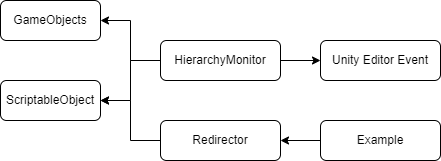

## Intro

This is an experimental tool inspired by the Unreal Engine redirector for Unity. There is `FormerlySerializedAsAttribute` in Unity, it is used to rename a field without losing its serialized value. 

A few days ago my friend stumbled across a problem because of the usage of `GameObject.Find`, it can’t find the game object because the game object was renamed. So, I thought we can have something like Unreal Engine redirector to solve this problem.

## Structure



### Data

- GameObjects
  
    This data comes from Unity Engine itself, to retrieve this I use
  
  ```csharp
  Resources.FindObjectsOfTypeAll(typeof(GameObject));
  ```

- ScriptableObject
  
    The scriptable object is used to store all the game objects. I create a custom class to hold the required data.
  
  ```csharp
  public class NameConfig
  {
      public int hashCode;
      public string oldName;
      public string newName;
  }
  ```
  
  - The hash code is the game object hash code, it uses to check whether a game object name is changed or not.
  - Old name store the current game object name.
  - New name store the new game object name.

### System

Since I can not find any event for rename I use `EditorApplication.hierarchyChanged`, below is the step I do to check rename in the game object.

- Listen to `EditorApplication.hierarchyChanged`.
- When there is any change in hierarchy,
- Find the data that match the hash code of the current game object.
- If any change then stores the new name otherwise clear it.

I also use a `MenuItem` to create a menu to register all the game objects manually. It will directly store the data in the ScriptableObject, I use it because working with ScriptableObject is easy and does not require any parsing.

## API

I want to override GameObject.Find but it seems I can’t do that, so I create an extension method so it gonna looks more natural,

```csharp
gameObject.FindByName("game object name");
```

## Conclusion

The `GameObject.Find` can be solved using redirector, but it is gonna need more improvement in the future. This experiment's purpose is to be a proof of concept. But it gonna need more effort to make a better and more advanced version of the redirector.

## Improvement

- Make sure if the hash code is persistent, I am not testing this yet.
- Change ScriptableObject to store data into text-based, e.g json, csv.
- Asset redirector, this gonna need to connect between the redirector data and the engine itself, besides the redirector needs to be compatible with the engine too.
- Script Redirector, use hash code to track any changes, basically similar to this experiment.

You can take a look at the code [here](https://github.com/AmdHamdani/Redirector).

---

Thank you for reading 😃 I hope you enjoy it.

Have a nice day.