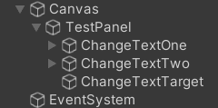

## Intro

I’ve been using unreal for sometimes and it’s a pretty amazing engine. I found that they have `UPROPERTY(meta=(BindWidget))` to binding UI variable declaration in the C++ code and the Widget.

```csharp
UPROPERTY(meta=(BindWidget))
UTextBlock* TextBlock_PlayerName;
```

Unreal will bind that variable into the UI component that has the same type and name. And lately, I also see that Godot has its own binding, and they improve it in Godot 3.5. But, I do not find Unity built-in UI binding. I did not check the UI Toolkit yet or any other frameworks. So I decide to make my own binding inspired by Unreal.

## Requirement

This UI binding must fulfil these criteria,

- Bind UI declaration in code with the UI component in the scene.
- Warn the User when the binding lost its reference.

## Implementation

### How to bind?

C# attribute is used for binding the variable, this attribute act as a mark and later the variable with this attribute or mark can be retrieved using reflection.



### How to assign the references?

The UI class need to inherit from `CanvasUI` class, a base class of each UI in this framework. We need to retrieve this class instance to assign the reference to the variable of this class. Using attributes for marking this class is possible, but I want to add basic functionality to the UI, so I need to use class.

```csharp
public class TestPanelUI : CanvasUI
{
    [BindUI] private Button ChangeTextOne;
    [BindUI] private Button ChangeTextTwo;
    [BindUI] private TMP_Text ChangeTextTarget;
}
```

### How to warn broken reference?

We want to warn the user that the reference may be broken when especially after they modify the scene, and after compiling. They may accidentally rename the GameObject or change the variable name.

We will listen `EditorApplication.hierarchyChanged` for scene modification and execute the code to validate the binding reference.

And we also use `DidReloadScripts` attribute, this will be triggered after unity recompiles its assemblies.

```csharp
[InitializeOnLoad]
public static class UIBindingValidator
{
    static UIBindingValidator()
    {
        EditorApplication.hierarchyChanged += ValidateUIBinding;
    }
    
    [DidReloadScripts]
    public static void ValidateUIBinding()
    {
        // Validation code here
    }
}
```

### Why use reflection?

Normally we bind the reference in the unity editor by drag-dropping the game object into the field. This may be fine in a small scope project but in a bigger project, this may take a longer time. So, we want to do it automatically for a different types of components. We need a reflection to help us find which variable and game object we want and bind them.

### Is it possible not to use reflection?

I believe it’s possible but with many limitations. It will require a lot more setup, such as 

- Declare using base class.
- Cast the reference.
- Difficult to check using field name.
- Need to wrap the variable if needed.

That’s the limitation I can think of. Reflection also does the same with the check but since we can use and check the type of field in runtime, we can find the right type and the right name for the reference.

## Setup

Follow the setup below to use the UI Binding in your games,

- Add the `GameCanvasSystem` into a GameObject.
- Create the UI class, and inherit it from `CanvasUI`.
    
    ```csharp
    public class TestPanelUI : CanvasUI
    {
    
    }
    ```
    
- Add the field you need, and make sure its name is the same as the one in the scene.
- Add `BindUI` attribute into the field.
    
    ```csharp
    public class TestPanelUI : CanvasUI
    {
        [BindUI] private Button ChangeTextOne;
        [BindUI] private Button ChangeTextTwo;
        [BindUI] private TMP_Text ChangeTextTarget;
    }
    ```
    
- Press play.
  

You can find the project [here](https://github.com/noodle-eater/Toolset/tree/master/Assets/Canvas).

---

Thank you for reading 😃 I hope you enjoy it.

Have a nice day.