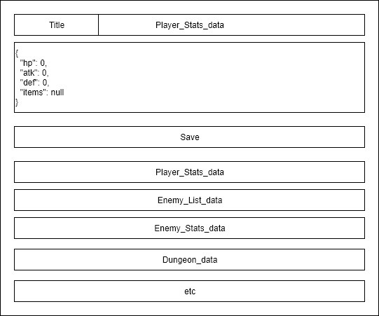
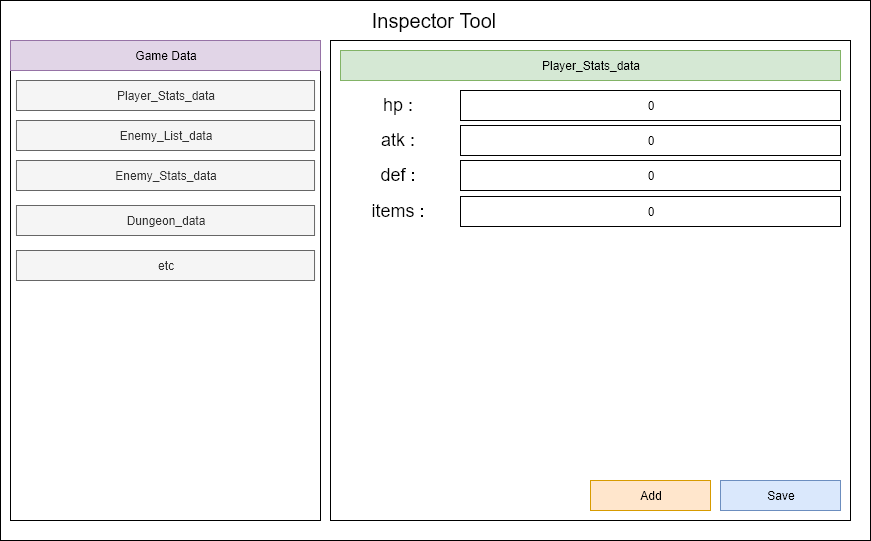

Recently I learn a book about "Designing the User Experience of Game Development Tools", the book is pretty straight forward and easy to understand. As a tools programmer this is a book that I must read, in order to make my tools better.

**What is User Experience?**

There are many definition about user experience, but from the I read. The populer one is from Elizabeth Sanders,

> Tools need to be, "Useful, Usable and Desireable"

**A. Useful**

The tool you make must fulfill user needs, or it will be useless. Ideally, these needs come from users & stakeholders. Before create your tools, you must know what your user & stakeholder needs, not what they want. You need to separate which one is needs & desire. Otherwise, you will have a bunch of task that you need to finish and it will make the development time longer.

Let say that our studio need a tools to manage data of the game that in development. You inspect the developer activities, ask their needs and talk with the stakeholder. And you got this list of user stories.

- As a user, I want to be able to inspect the save data.
- As a user, I want to be able to change the data from admin panel.
- As a user, I want to export the save data into different format.
- As a user, I want to manipulate the game saved data.
- As a user, I want to change the save data in runtime.

We need to decide which one will be the needs & desire, if you do all at once you will not ship your tools. Not at a short time at least, but your studio need the tools as soon as possible.

After discussion with the tools team we decide that these are the needs. Why these? First our tools need to show the user all the save data that the game has, otherwise it will be pointless to add more functionality, when they even do not know the data. And we can provide the with a functionality to manipulate the data.

- As a user, I want to be able to inspect the save data.
- As a user, I want to manipulate the game saved data.

Why we do not choose these? this features is awesome but we still do not need it. especially for exporting the data in the different format, I think we must standarize our save data rather that support many format, since it will give a burden when maintain it in the future. Changing save data from admin panel, will be a good features when our game is live so we can update our game from the admin panel without need to rebuild the game. But because we are still in the development phase, we can save this for next. Save data in runtime is also a good feature especially for QA so they can easily test the game, but this features is not needed yet now.

- As a user, I want to be able to change the data from admin panel.
- As a user, I want to export the save data into different format.
- As a user, I want to change the save data in runtime.

After a few days working on the main functionality, you finally come up with the basic version of your inspection tool. Now in the sprint review you can show this and you can proud of it, because you make it. And at the end of the sprint you can ship your product to your user. And waiting for their feedback while improving the current Inspector Tool.

**B. Usable**

There are many definitions of usability, these definition include question such as.

- How efficient is it to use?
- How easy is it to learn?
- How well is the user protected from making mistakes?
- How satisfying is it to use?

In my opinion, usability itself is

> How me make our tool easy to use by other & reduce the chance of mistakes happen when using the tool.

After release your Inspector Tool you get some feedback from programmer in your company that use the tool.

- This tool help me inspect the game data & I do not need to print everything
- The game getting error after I update some value
- I got confuse, the list below save button is the list of data?

Our tool already meet the needs of our user but it still not usable yet, we know it from our user feedback. First we need to analyze the feedback and understand why this is happen.

In the feedback we know that the user get some error when update the value, since we are dealing with json file. There is a probability the user write wrong json syntax. Rather than show all the json, we can create some field that will hold the json data. And to make use do not confuse with the list of json, we can create a box area and give it a title. And we can update our Inspector Tool.

**C. Desireable**

The last aspect that usually feels not importan or does not contribute enough to UX. However, a tool that have good aesthetic & appealing design contributes not only to user satisfaction but also will make the user believe that the designer have taken their time to create high-quality, profesional tool and make user more confidence in using it.

To make our Inspector Tool more desireable, we can change our tools design and make it more eye catching. We can separate our list of data into left side and the right side for updating the data. Do not forget to add some good UI & color for the tools.

**Being "More Human"**

The tool you make must resemble interaction with a good friend, and a bad tools will make you interact with frustrating people and it will make you piss off.

> Create a tool that can be a good friend for user, so they will use it because they need it. Not because they do not have any choice.
